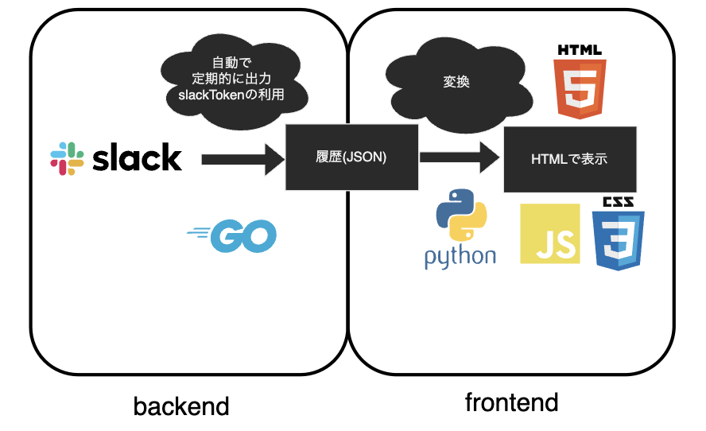

# slackHistory

Slack の過去の履歴は JSON ファイルに出力されます。それを HTML を用いて見やすくしたいリポジトリです。

<p align="center">

</p>

## 概要

**バックエンド**とは Slack API を用いて履歴を json ファイル出力する機能のことです。
**フロントエンド**とは json ファイルから Slack のトーク画面を再現する機能のことです。
#### ファイル構成

```:バックエンド
backend
├── exampleCode
│   参考コード
├── main
│   main 機能
├── other
│   Python で履歴を取得コード　など
├── slackModule
│   Go のモジュール
├── typeChange
│   Go のモジュール
├── reference.txt
│   参考文献
└── todo.txt
    Todo
```

```:フロントエンド
frontend
├── slackJsonToHtml.py
│   Json → Markdown → HTML の順で変換
└── style.css
```

#### 開発環境

```:開発環境
OS Mac M1
go version go1.18.4 darwin/arm64
Python 3.11.0
```

**以降は編集中**

#### 備考


フロントエンドについて
2022 年の 8 月までの履歴を用いてとりあえずのものを作りました。履歴が増えるたびに追記するとかはできません。
JSON → Markdown → HTML の順で変換していますが
始めは Markdown で作ろうとしていましたが CSS でデザインするならということで md から HTML に変換するライブラリを用いました。とりあえずなので効率とか調査はろくに気にしていません。
Slack から自動で 1 ヶ月ごとに履歴を JSON でもらってくる
3 カ月ごとに履歴が消される

## 進み具合

一通りの流れを作成した

## 次の作業

全体の流れや作業を確認
各チャンネルの履歴を並行して出力させる
