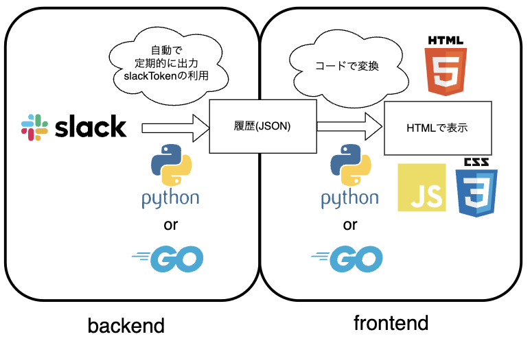

## slackHistory
Slack の過去の履歴は JSON ファイルに出力されます。それを HTML を用いて見やすくしたいリポジトリです。

## 図の説明
あくまで案の 1 つであり, 他に履歴を見る案があれば教えてほしいです。JSON の履歴を使わないや Slackに送ると同時にメッセージを他アプリに転送など
### フロントエンド
JSON 出力された履歴を見やすくする

例) HTML で表示
2022 年の 8 月までの履歴を用いてとりあえずのものを作りました。履歴が増えるたびに追記するとかはできません。
JSON → Markdown → HTML の順で変換していますが
始めは Markdown で作ろうとしていましたが CSS でデザインするならということで md から HTML に変換するライブラリを用いました。とりあえずなので効率とか調査はろくに気にしていません。
### バックエンド
Slack から自動で 3 ヶ月ごとに履歴を JSON でもらってくる
3 カ月ごとに見れなく (得れなく？) なるので
slack トークンというのがありそれでできそう
## 開発環境
ブランチは図に示す frontend, backend を用意している
## 進み具合
2022 年 8 月以前のものは最低限見れるように作成
他計画等まだ

